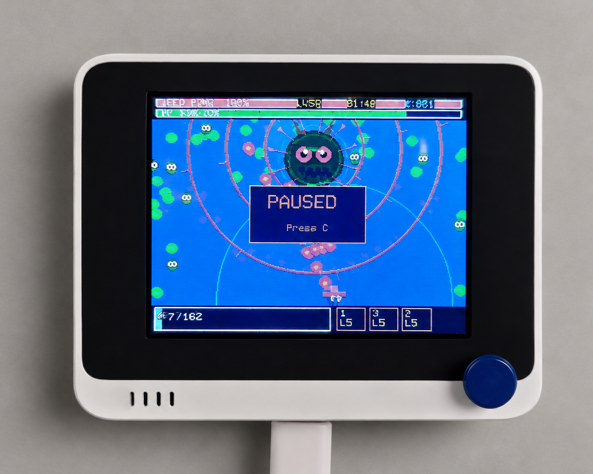

# 割草幸存者 (Weed Survivor)

> 一款运行在 **Wio Terminal** 上的吸血鬼幸存者风格割草游戏。320×240 彩色屏幕，< 100KB 固件，满屏 120 只怪物流畅运行，用最小的硬件、最少的代码，做出最爽的割草体验。

  

## 游戏特性

- 🎮 **完整游戏循环**：开始画面 → 战斗 → 升级选择 → BOSS 战 → 通关/Victory
- ⚔️ **3 种武器** + 进化系统（叶片/镰刀/光环），满级可进化终极形态
- 👾 **5 种敌人**：杂草、蒲公英、荆棘球、精英草王、最终 BOSS 杂草之王
- 🔊 **PWM 音效引擎** + 屏幕震动反馈，无需额外硬件
- 💎 **经验宝石** + 升级树（武器 + 被动技能）

## 硬件规格

| 项目 | 规格 |
|------|------|
| 主控 | Wio Terminal (ATSAMD51P19, 120MHz Cortex-M4F, 192KB RAM) |
| 屏幕 | 2.4 寸 TFT LCD，320×240 像素 |
| 外形尺寸 | 72mm × 57mm × 19mm |
| 重量 | 约 55g |
| 连接 | USB Type-C（供电 + 烧录） |

## 操作方式

| 按键 | 功能 |
|------|------|
| 五向摇杆 | 移动角色、升级时上下选择和确认 |
| A 键 | 开始游戏 / 重新开始 |
| C 键 | 暂停 / 继续 |

## 配套文档

| 文档 | 内容 |
|------|------|
| [视频介绍脚本](./docs/视频介绍脚本.md) | 3-5 分钟演示脚本，覆盖创作灵感、核心功能、技术亮点、应用前景 |
| [背景信息概况](./docs/背景信息概况.md) | 项目定位、解决什么问题、为谁设计、市场价值、竞品对比 |
| [硬件清单](./docs/硬件清单.md) | 完整 BOM、尺寸规格、硬件连接关系图 |
| [技术文档](./docs/技术文档.md) | 开发环境配置、架构说明、问题排查，确保可复现 |
